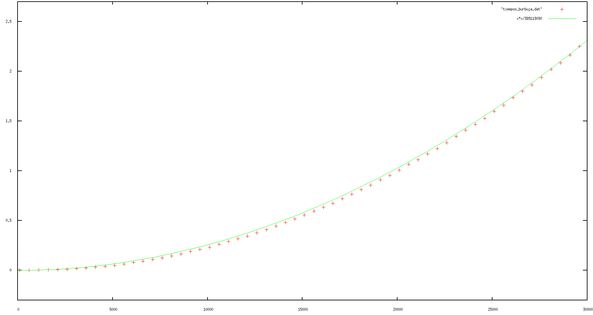
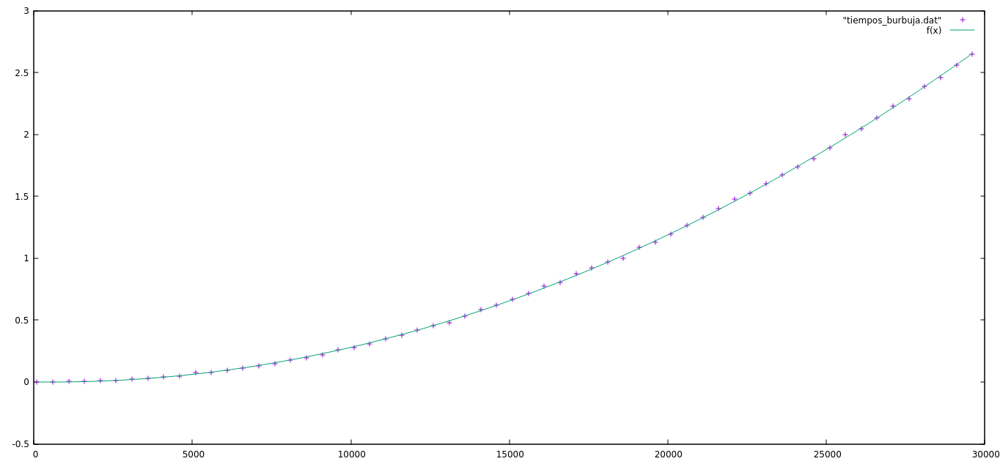

# Estructura de datos - Práctica 1

Francisco Javier Sáez Maldonado
 y Luis Antonio Ortega Andrés

2º Doble Grado en Ingeniería Informática y Matemáticas

## Ejercicio 1.

Teniendo el siguiente algoritmo:

```c++
void ordenar(int * v , int n) {

  for (int i=0; i<n-1; i++)

    for (int j=0; j<n-i-1; j++)

      if (v[j]>v[j+1]) {

        int aux = v[j];
        v[j] = v[j+1];
        v[j+1] = aux;
      }
}

```


Vamos a calcular  primero su eficiencia teórica. Para ello estableceremos según la notación O grande el peso de cada una de las partes.

```c++
void ordenar(int * v, int n) {

  for (int i=0; i<n-1; i++) // (n-1)O(1) = O(n-1)

    for (int j=0; j<n-i-1; j++)// (n-1)O(1) = O(n-1)

      if (v[j]>v[j+1]) { //O(1)

        int aux = v[j]; //O(1)
        v[j] = v[j+1]; //O(1)
        v[j+1] = aux; //O(1)

      }
}
```

Así, como en los bucles anidados, usamos la regla del producto O(f(n))O(g(n)) = O(f(n)g(n)) y de esta forma tenemos que "el polinomio de la eficiencia teórica del algoritmo es" O((n-1)4*(n-1)). El 4 está porque dentro del segundo bucle tenemos 4 operaciones que son O(1).

Sin embargo, por la notación O grande, podemos obviar los coeficientes del monomio de mayor grado e incluso obviar los demás monomios, por lo que el polinomio queda reducido a ser O(n^2), siendo esta la eficiencia teórica del código.

Ahora, creamos un fichero **ordenación.cpp** insertando este código para ordenar un vector. Para ello, nos hemos ayudado de los que venían de prueba.

```c++

#include <iostream>
#include <ctime>    // Recursos para medir tiempos
#include <cstdlib>  // Para generación de números pseudoaleatorios

using namespace std;

void ordenar(int * v, int n) {

  for (int i=0; i<n-1; i++)

    for (int j=0; j<n-i-1; j++)

      if (v[j]>v[j+1]) {

        int aux = v[j];
        v[j] = v[j+1];
        v[j+1] = aux;

      }
}


void sintaxis()
{
  cerr << "Sintaxis:" << endl;
  cerr << "  TAM: Tamaño del vector (>0)" << endl;
  cerr << "  VMAX: Valor máximo (>0)" << endl;
  cerr << "Se genera un vector de tamaño TAM con elementos aleatorios en [0,VMAX[" << endl;
  exit(EXIT_FAILURE);
}


int main (int argc, char* argv[]) {

  if (argc!=3)
    sintaxis();
  int tam=atoi(argv[1]);     // Tamaño del vector
  int vmax=atoi(argv[2]);    // Valor máximo
  if (tam<=0 || vmax<=0)
    sintaxis();

  // Generación del vector aleatorio
  int * v=new int[tam];       // Reserva de memoria
  srand(time(0));            // Inicialización del generador de números pseudoaleatorios
  for (int i=0; i<tam; i++)  // Recorrer vector
    v[i] = rand() % vmax;    // Generar aleatorio [0,vmax[

  clock_t tini;    // Anotamos el tiempo de inicio
  tini=clock();

  ordenar(v,tam); // de esta forma forzamos el peor caso

  clock_t tfin;    // Anotamos el tiempo de finalización
  tfin=clock();

  // Mostramos resultados
  cout << tam << "\t" << (tfin-tini)/(double)CLOCKS_PER_SEC << endl;

  delete [] v;     // Liberamos memoria dinámica

}


```

Ahora, creamos el script que nos sirve para realizar de forma automática las ejecuciones de nuestro programa.

```sh
#!/bin/csh                                                                      
@ inicio = 100                                                                  
@ fin = 30000                                                                   
@ incremento = 500                                                              
set ejecutable = burbuja                                                        
set salida = tiempos_burbuja.dat                                                
@ i = $inicio                                                                   
echo > $salida                                                                  
while ( $i <= $fin )                                                            
  echo Ejecución tam = $i                                                       
  echo `./{$ejecutable} $i 10000` >> $salida                                    
  @ i += $incremento                                                            
end   

```

Por último, pintamos la gráfica con GNUPLOT quedando el siguiente resultado.



Donde podemos ver que la linea verde es la eficiencia teórica y las cruces rojas es la eficiencia resultante al ejecutar nuestro programa en un ordenador que realiza 389119090 operaciones por segundo ejecutando este programa.

Ya que el numero de datos no es excesivamente elevado, la eficiencia teórica y la práctica son bastante parecidas.


## Ejercicio 2.

Ahora, ajustamos los datos a una función cuadrática. Para ello, dentro de GNUPLOT usamos

```GNUPLOT
f(x) = a*x**2 + b*x + c
fit f(x) "tiempos_burbuja.dat" via a, b, c
plot f(x), "tiempos_burbuja.dat"

```

Y obtenemos así esta gráfica:




## Ejercicio 3.

El código del ejercicio es el que hemos usado para hacer los dos primeros ejercicios salvo la función que se realiza sobre el vector. En este caso la función es:

```c++
int operacion(int * v, int n, int x, int inf, int sup) {
  int med;  //Declaro una medida
  bool enc=false;

  while ((inf<sup) && (!enc)) {
    med = (inf+sup)/2;  
    if (v[med]==x)
      enc = true;
    else if (v[med] < x)
      inf = med+1;
    else
      sup = med-1;
  }
  if (enc)
    return med;
  else
    return -1;
}
```

Lo que hace esta función (y por tanto este programa, pues se centra en la función) es buscar un elemento en un vector, de forma que se va primero al medio del vector y comprueba si es el elemento que buscamos. Si no lo es, se mira si el dato buscado es es mayor, va a volver a buscar en el mismo vector pero tomando solo la parte que queda a la derecha de la mitad y si es menor busca en la parte que está a la izquierda de la mitad. Para seguir buscando, vuelve a realizar el mismo proceso que acaba de hacer en el subvector que corresponda(de la izquierda o de la derecha).Este algoritmo es conocido como **búsqueda binaria**

Calculemos ahora su eficiencia.

```c++
int operacion(int * v, int n, int x, int inf, int sup) {
  int med;  //Declaro una medida

  bool enc=false; // O(1)

  while ((inf<sup) && (!enc)) { // O(logaritmo en base 2 de n)
    med = (inf+sup)/2;  // O(1)
    if (v[med]==x) // O(1)
      enc = true; // O(1)
    else if (v[med] < x) // O(1)
      inf = med+1; // O(1)
    else
      sup = med-1; //O(1)
  }
  if (enc) // O(1)
    return med;//  O(1)
  else //O(1)
    return -1; // O(1)
}
```

Primero tenemos una declaración y una declaración y asignación: 3*O(1).
Ahora, podemos ver que como tenemos un bucle usamos la *regla del producto* y tenemos que multiplicar O(logaritmo en base 2 de n) por lo que haya dentro del bucle, que en este caso es O(1) en la asignación y como tenemos un **IF/ELSE** aplicamos la regla del máximo de ellos, que en este caso es en todas 2*O(1) luego es irrelevante.
Después, volvemos a tener un IF/ELSE en el que los dos son 2*O(1) y por ello la regla del maximo tambien escoge a cualquiera de los dos.

Ahora, como todo ese código no está dentro de ningún bucle, aplicamos la *regla de la suma* y tenemos por tanto:

\[
O(3)+O(l_2 n)*O(2) +O(2) = O(3+ 2*l_2n+2)
\]

Sin embargo, por la notación O grande podemos resumir en que eso es igual a $O(l_2n)$ y esta es nuestra eficiencia teórica.
